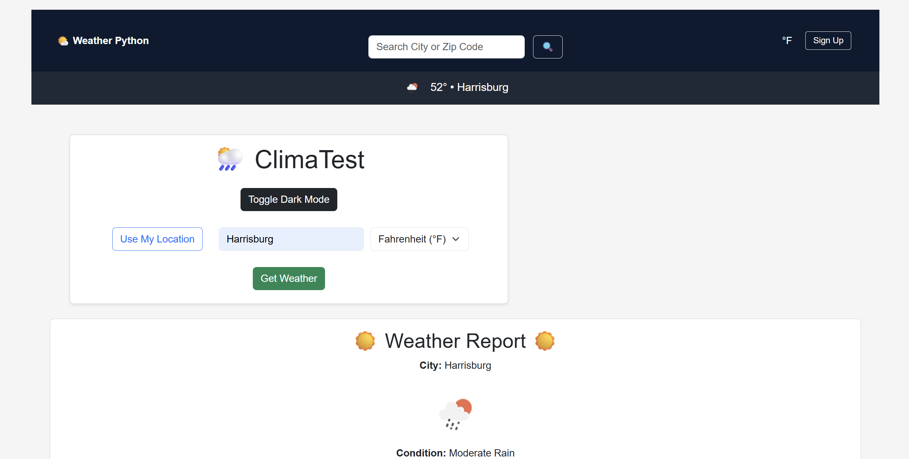

# 🌤️ ClimaTest (Weather App)

A polished weather app built with **Flask**, **Bootstrap**, and the **OpenWeatherMap API**.
Designed to showcase real-world backend skills in a clean, user-friendly UI.

---

## ✅ Features

- 🌦️ Real-time weather data by city
- 🌎 Auto-detect location via IP
- 📋 Search history stored in SQLite
- 🌓 Dark mode toggle
- 🌀 Loading spinner
- 📂 `.env` file for secret API key
- ⚙️ Polished Bootstrap 5 layout

---

## 🚀 Run Locally

```bash
git clone https://github.com/rinnemunch/weather-app.git
cd weather-app
```

1. Set up a virtual environment

```bash
python -m venv venv
# Activate it:
# On Windows
venv\Scripts\activate
# On Mac/Linux
source venv/bin/activate
```

2. Install dependencies

```bash
pip install -r requirements.txt
```

3. Create .env file

```bash
# .env
API_KEY=your_api_key_here
```

Get a free API key from openweathermap.org

4. Run the app

```bash
python app.py
```

Visit: http://localhost:5000

## 💻 Stack

- Python + Flask
- SQLite (for city search history)
- HTML + Bootstrap
- JavaScript (client-side logic)
- CSS
- dotenv (for managing secrets)

## 📸 Screenshot



## 🛡️ Notes

This project was built as a **learning showcase** for Flask and API integration.
It prioritizes clarity, design, and functionality — not production hardening.
